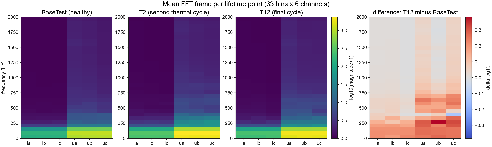

# Motor Degradation Estimation

This project is designed to work exclusively with DEEPCRAFT™ Studio. Download it from [here](https://softwaretools.infineon.com/assets/com.ifx.tb.tool.deepcraftstudio).

## Overview - Use-Case

The **Motor Degradation Estimation** project builds an end-to-end **regression** system that estimates the degradation state of an induction motor (0 = healthy, 1 = failure) from its electrical signals — three-phase currents and three-phase voltages — with no additional sensors.

Insulation aging can cause induction-motor failure and is invisible to simple amplitude monitoring: the current envelope tracks *load*, not *health*. A small Conv1D+LSTM regression model on FFT features of the electrical signals can track degradation continuously over the machine's whole life, enabling remaining-useful-life estimation on low-cost edge hardware that only taps the motor terminals, thus eliminating the need for additional sensors.

The regression model can be used in applications for

- **Predictive maintenance:** Track insulation-related aging continuously instead of waiting for a binary fault flag
- **Industrial IoT and appliances:** Monitor motors where vibration, temperature, or flux sensors are impractical or too costly
- **Automotive and safety monitoring:** Estimate health from electrical terminals already present in the drive

Users can further expand this project by training their own models, importing new data, and evaluating performance using the provided tools.

- **Machine learning method:** Conv1D+LSTM regression trained in DEEPCRAFT™ Studio
- **Sensor and data type:** Three-phase current (`ia`, `ib`, `ic`) and three-phase voltage (`ua`, `ub`, `uc`) at 4 kHz
- **Why it matters:** Enables remaining-useful-life style monitoring from motor terminals alone, provided the model is trained on electrical data that match the deployment machine


## Features

1. **Continuous degradation estimate:** The project uses a Conv1D+LSTM regression model to output a value in [0, 1] that tracks aging from a healthy reference through insulation failure.
2. **Electrical-only sensing:** Six channels of current and voltage are the only inputs, so no extra vibration, temperature, or flux sensors are required.
3. **Custom data integration:** Users can add further motor sessions (same six-channel format at 4 kHz) and retrain for other machines or operating conditions.
4. **Model evaluation:** Evaluate trained models in DEEPCRAFT™ Studio; the test set includes a concatenated multi-day timeline for reviewing predictions over the machine's life.

## Contents

- **`Data`:** Electrical sessions from an 11 kW induction motor, grouped by aging day (`BaseTest`, `T2`…`T12`) plus `Data/FullTimeline/` for a concatenated life review.

- **`Models`:** Stores trained regression models, quantized versions, and their predictions.

- **`Resources`:** Supporting figures for waveforms, FFT features, labels, and timeline results (`Resources/images/`).

- **`PreprocessorTrack`:** Preprocessed feature tracks generated by the project preprocessor.

## Sensor(s) & Data

An 11 kW induction motor was thermally overloaded during working hours and rested overnight — one thermal cycle per day — until insulation failure after 12 cycles. This accelerated-aging campaign was collected during the PhD work of Zanuso at KTH [[1]](#citations). See that thesis for the experimental setup, aging procedure, and further measurement details.

Electrical data is stored as DEEPCRAFT™ Studio regression sessions under `Data/`. Each session contains a six-channel `data.csv` (`ia`, `ib`, `ic`, `ua`, `ub`, `uc`) and a `label.csv` target (`Damage`). Sampling is 4 kHz; sessions last about 4 s.

- 356 sessions of ~4 s each: 6 channels at 4 kHz.
- Day tags: `BaseTest` (healthy reference) and `T2`…`T12` (aging cycles).
- Regression target (`label.csv`, one value per sample): degradation = thermal_cycle / 12, so `BaseTest` = 0.0 and `T12` = 1.0 (failure).
- Pre-assigned datasets: 214 train / 70 validation / 73 test, stratified per day so every degradation stage appears in every set. The test set includes `Data/FullTimeline/Base_T2_T6_T12`, a concatenated 4-day session for reviewing predictions over the machine's life.

Raw waveforms barely change from the first overload day to the failure day: insulation aging is **not visible** in the time-domain currents and voltages, and **cannot be predicted from raw signals alone**. Amplitude envelopes track load, not health; the failure signature lives in the harmonics (see plots below):


**Preprocessing**

Sliding window [64, 6] (stride 60) → Hann → real FFT (window axis) → Frobenius norm → **[33, 6]** feature frame (33 frequency bins × 6 channels, one frame per 15 ms). Degradation appears as a broadband redistribution of harmonic energy (see images below):




**Results**

The reference model tracks the machine's aging monotonically across all 12 cycles (Pearson r ≈ 0.95 vs. labels after smoothing; 10 of 11 day-over-day transitions increase):


## Adding More Data

You can add more data to the project following the steps below to improve estimation on a new motor, load, or drive.

1. Capture three-phase current and three-phase voltage at **4 kHz** with the same channel order (`ia`, `ib`, `ic`, `ua`, `ub`, `uc`).
2. Import sessions into `Data/` and assign a regression target in `label.csv` (for example thermal_cycle / N, or another health index in [0, 1]).
3. Keep the train / validation / test split stratified by degradation stage so every aging level appears in every set.
4. Retrain to get an updated model.

You can also import data from any other source (for example, your own bench tests or another motor campaign) as long as it follows the DEEPCRAFT™ Studio regression format: time-series `data.csv` with matching `label.csv`. See [Bring your own data](https://developer.imagimob.com/deepcraft-studio/data-preparation/bring-your-data/bring-your-own-data).

## Steps to Production

The recommended path to production for this project includes the following steps:

- **Add data from the target motor.** This starter set comes from a single 11 kW machine and a single accelerated-aging run. Collect electrical sessions on the production motor (same terminals, sampling rate, and load envelope) and retrain before relying on the estimate in the field.
- **Treat labels as proxies.** The provided labels are derived from the thermal-cycle schedule, not from a measured insulation state. If you have a better health index (partial discharge, insulation resistance, or remaining life from a physics model), use that as the regression target.
- **Smooth the output in application code.** The raw per-window output is noisy, with occasional spikes outside [0, 1]. Custom pipeline units for this are not part of this project; deployments should:
  1. Clip to [0, 1].
  2. Apply an exponential lowpass `y[i] = alpha * x[i] + (1 - alpha) * y[i-1]` with `alpha = 0.2`, optionally preceded by a short median filter (~2 s) to reject spike outliers.
- **Expect slow dynamics.** Degradation evolves over days, so aggressive smoothing costs nothing in responsiveness.
- **Plan for domain adaptation.** Transferring to other motors, drives, or loads typically requires extra data; do not assume the starter model generalizes unchanged.

## Attribution & Citation

<a name="citations"></a>

```bibtex
@phdthesis{Zanuso_2022, 
  place={Stockholm},
  title={Condition monitoring of stator windings with a networked electric drive}, 
  journal={Condition Monitoring of Stator Windings with a Networked Electric Drive}, 
  school={KTH Royal Institute of Technology}, 
  author={Zanuso, Giovanni},
  year={2022}, 
  pages={1–107}} 
```
```bibtex
 @ARTICLE{7466454,
  author={},
  journal={IEEE Std 117-2015 (Revision of IEEE Std 117-1974)}, 
  title={IEEE Standard Test Procedure for Thermal Evaluation of Systems of Insulating Materials for Random-Wound AC Electric Machinery}, 
  year={2016},
  volume={},
  number={},
  pages={1-34},
  keywords={IEEE Standards;Machinery;Insulation;Thermal degradation;AC machines;Thermal evaluation;ac electric machinery;IEEE(TM);insulation system;random-wound;thermal evaluation},
  doi={10.1109/IEEESTD.2016.7466454}}

```
## Getting Started

Please visit [developer.imagimob.com](https://developer.imagimob.com), where you can read about DEEPCRAFT™ Studio and go through step-by-step tutorials to get you quickly started.

For bringing your own time-series data into Studio, see [Bring your own data](https://developer.imagimob.com/deepcraft-studio/data-preparation/bring-your-data/bring-your-own-data).

## Help & Support

If you need support or if you want to know how to deploy the model onto the device, please submit a ticket on the Infineon [community forum](https://community.infineon.com/t5/Imagimob/bd-p/Imagimob/page/1) DEEPCRAFT™ Studio page.
